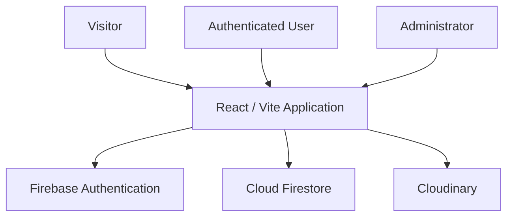

# Ecommerce Template

Reusable e-commerce template built with **Vite, React, TypeScript and Firebase**, designed to provide a solid starting point for catalog, authentication, cart, checkout, reservations, inventory and administration workflows.

The project is prepared to work with the **Firebase Spark plan**, using Firebase Authentication and Cloud Firestore, while product images are handled through Cloudinary.

> **Template scope**
>
> This repository is a reusable technical template. Client-specific implementations, credentials, branding and production data are maintained separately.

---

## Overview

The template provides a complete foundation for small and medium e-commerce implementations without requiring a custom backend from the beginning.

It includes:

- Public product catalog
- Categories and product detail pages
- Local persistent cart
- User authentication
- Customer profile
- Orders and reservations
- Private customer request history
- Administrative product and category management
- Inventory control
- Firestore transactions
- Role-based access
- Cloudinary image uploads
- Commercial calculations
- Simulated payment flows
- Administrative sales and profit reporting

The architecture intentionally separates public catalog data from private commercial information such as costs, profit margins and administrative details.

---

## Tech Stack

### Frontend

- Vite
- React
- TypeScript
- Responsive CSS architecture

### Cloud

- Firebase Authentication
- Cloud Firestore
- Firebase Emulator Suite

### Images

- Cloudinary

### Tooling

- Yarn `1.22.22`
- Node.js `24` validated
- TypeScript strict validation
- Linting
- Unit / integration checks
- Hosting validation
- Production builds

---

## Architecture



The project does not require:

- Firebase Cloud Functions
- Firebase Storage
- A Firebase billing account for the base architecture

Cloudinary is used for public product images.

---

## User Roles

### Visitor

Visitors can:

- Browse the active catalog
- Explore categories
- View product details
- Maintain a local cart

### User

Authenticated users can:

- Manage their profile
- Submit orders
- Submit reservations
- Reuse saved customer information
- Review their private request history

### Admin

Administrators can:

- Manage products
- Manage categories
- Review customer requests
- Filter commercial requests
- Manage inventory
- Review private commercial data
- Confirm orders and reservations
- Access sales and profit information

Administrative access is enforced through Firebase authorization rules and admin claims.

---

## Catalog & Data Privacy

The public catalog exposes only the information required by customers.

Private commercial fields remain restricted.

Examples of private data:

- Product cost
- Profit amount
- Internal commercial calculations
- Inventory management information
- Customer NIT
- Administrative totals

Only administrators can write catalog data.

Sensitive commercial values must never be stored in public documents or exposed through public `VITE_*` environment variables.

---

## Pricing Model

The default pricing model is:

```text
Final Price = Cost + Fixed Profit + Percentage Surcharge
```

The initial surcharge is **16% applied to cost + profit**.

Example:

```text
Cost:          Bs 5,000
Fixed profit:  Bs   200
Subtotal:      Bs 5,200
16% surcharge: Bs   832
-----------------------
Final price:   Bs 6,032
```

The percentage and store behavior can be adapted during implementation.

---

## Checkout Model

Checkout creates a persistent commercial request instead of trusting prices calculated by the browser.

```text
Customer
   ↓
Cart
   ↓
Authenticated Checkout
   ↓
Firestore Request
   ↓
Admin Review
   ↓
Recalculation / Validation
   ↓
Confirmation
```

The administrator recalculates and validates commercial values before confirmation.

This prevents the client application from becoming the authoritative source for pricing.

---

## Orders & Reservations

The template supports both orders and reservations.

### Orders

Orders are stored as authenticated customer requests and managed through the administrative interface.

### Reservations

The default reservation workflow:

- Requires administrative confirmation
- Commits inventory after confirmation
- Uses a 24-hour reservation period
- Can be manually expired from the admin panel

The reservation policy can be customized for each implementation.

---

## Payment Demonstration

QR, card and PayPal options are currently presented through a **demonstration modal**.

The template does **not** capture real banking or card information.

A production implementation should integrate a verified payment provider and validate payment status through a trusted server-side or provider-controlled workflow.

---

## Inventory

Inventory changes are handled through Firestore transactions where required.

The administrative request view can expose:

- Category
- Cost
- Profit
- Surcharge
- Final price
- Availability
- Quantities
- Commercial totals

These values remain private to administrative workflows.

---

## Routes

| Route | Purpose |
|---|---|
| `/` | Home |
| `/productos` | Product catalog |
| `/categorias/:slug` | Category |
| `/productos/:slug` | Product detail |
| `/carrito` | Persistent local cart |
| `/checkout` | Authenticated order / reservation submission |
| `/cuenta` | Private customer profile |
| `/mis-solicitudes` | Customer request history |
| `/login` | Sign in |
| `/registro` | Registration |
| `/recuperar-acceso` | Account recovery |
| `/admin` | Admin dashboard |
| `/admin/productos` | Product management |
| `/admin/categorias` | Category management |
| `/admin/solicitudes` | Request management |

Unknown routes render the application 404 page.

When deploying as an SPA, hosting must redirect internal application routes to `index.html`.

---

## Project Structure

Main customization areas:

```text
src/
├── config/
│   └── store.config.ts
│
├── features/
│   ├── catalog/
│   ├── admin/
│   ├── cart/
│   └── orders/
│
├── infrastructure/
│   ├── firebase/
│   └── cloudinary/
│
└── styles/
```

### `src/config/store.config.ts`

Central store configuration:

- Brand
- Contact information
- Pickup
- Shipping
- Reservation settings
- Theme

### `src/features/catalog`

Public catalog and product presentation.

### `src/features/admin`

Administrative workflows.

### `src/features/cart`

Local cart state for visitors and authenticated users.

### `src/features/orders`

Orders, reservations, customer history and commercial statuses.

### `src/infrastructure/firebase`

Authentication and Firestore adapters.

### `src/infrastructure/cloudinary`

Image validation and Cloudinary upload integration.

### `src/styles`

Responsive visual system and application styling.

---

## Getting Started

### Requirements

- Node.js `24`
- Yarn `1.22.22`

Install dependencies:

```sh
yarn install --frozen-lockfile
```

Start the development server:

```sh
yarn dev
```

---

## Quality Checks

Available validation commands:

```sh
yarn lint
yarn typecheck
yarn test
yarn test:integration
yarn test:hosting
yarn build
```

These checks should be executed before creating a production implementation from the template.

---

## Firebase Setup

Copy the example environment file:

```sh
cp .env.example .env.local
```

Add the Firebase web configuration for your project.

Then validate the integration:

```sh
yarn firebase:check
yarn firebase:smoke
```

### Firestore Rules & Indexes

Deploy the template rules and indexes to your own Firebase project:

```sh
yarn firebase:deploy   --only firestore:rules,firestore:indexes   --project <PROJECT_ID>   --non-interactive
```

Do not reuse the Firebase project from another implementation.

Each deployment created from this template should use its own Firebase project and configuration.

---

## Admin Access

Administrator privileges are assigned outside the application.

The admin UID and email must match exactly.

```sh
yarn firebase:admin --project <PROJECT_ID> --uid <UID> --email <EMAIL>
```

Grant the corresponding admin claim:

```sh
yarn firebase:admin   --project <PROJECT_ID>   --uid <UID>   --email <EMAIL>   --grant
```

After changing claims, sign out and sign in again so the user session receives the updated authorization state.

---

## Cloudinary Setup

The template uses Cloudinary for public product images.

Required public variables:

```env
VITE_CLOUDINARY_CLOUD_NAME=your-cloud-name
VITE_CLOUDINARY_UPLOAD_PRESET=your-unsigned-preset
```

Never expose a Cloudinary `API_SECRET` through a `VITE_*` environment variable.

The current template supports:

- Administrative image upload
- Local preview
- HTTPS image URL fallback

For production deployments, review the security restrictions of the upload preset and consider a signed upload workflow when stronger upload controls are required.

---

## Local Firebase Emulators

Run Firebase emulators:

```sh
yarn emulators
```

In another terminal, start the application connected to the local Firebase environment:

```sh
yarn dev:emulator
```

Rule integration tests can be executed with:

```sh
yarn test:integration
```

---

## Customization

A new implementation should normally customize:

- Brand identity
- Store information
- Contact information
- Shipping rules
- Pickup options
- Reservation duration
- Product categories
- Pricing model
- Firebase project
- Cloudinary configuration
- Administrative users
- Payment provider
- Visual theme

Client-specific configuration should remain outside the public template.

---

## Security Notes

Before using the template in production:

- Use a dedicated Firebase project
- Review Firestore rules
- Review Firestore indexes
- Restrict administrative permissions
- Never trust commercial totals coming from the browser
- Never expose secrets through `VITE_*`
- Review Cloudinary upload restrictions
- Replace simulated payment flows with a verified provider
- Validate production hosting configuration
- Review customer data retention and privacy requirements

---

## Roadmap

Potential next improvements for the template:

- Replace provisional store data with configurable onboarding
- Integrate a verified payment provider
- Improve initial bundle loading
- Add stronger Cloudinary upload authorization
- Expand automated end-to-end testing
- Improve production observability
- Add optional deployment presets

---

## Using This Repository as a Template

This repository is configured as a GitHub **Template Repository**.

Use **Use this template** to create a new independent implementation.

Each generated project should receive its own:

- Firebase project
- Environment configuration
- Cloudinary configuration
- Branding
- Business rules
- Administrative accounts
- Production credentials

Client-specific implementations are intentionally maintained separately from this public template.

---

## Project Purpose

This repository is published as a reusable technical reference and portfolio project.

It is intended for software development, learning and experimentation.

It should not be treated as a turnkey academic submission or presented as original academic work without substantial independent development and attribution.

---

## Author

**Alfredo Ramos**

Software Engineer  
Full Stack · Mobile · Backend · Data · GIS · Machine Learning

GitHub: [@wolcken](https://github.com/wolcken)  
LinkedIn: [alfredoramos-dev](https://www.linkedin.com/in/alfredoramos-dev/)
